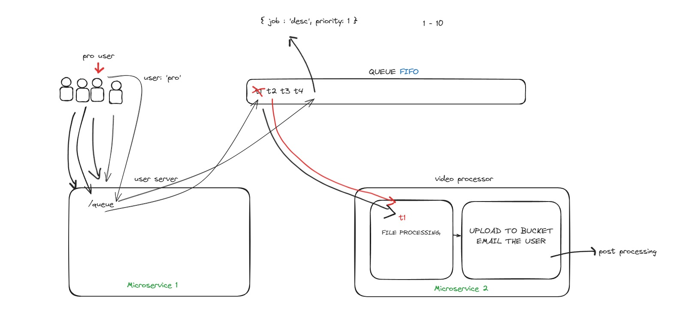

## Architecture overview



1. Fire up the docker compose using 
   ```
   docker-compose up
   ```
2. Redisinsight would be up and running on localhost:5540
    - Now as each container operates within its own isolated environment, we've to find the IP of Redis container
    - Use the command ```docker container inspect -f "{{range .NetworkSettings.Networks}}{{.IPAddress}}{{end}}" redis``` // returns e.g 172.20.0.3
    - Connect to redis on redisInsight at 172.20.0.3:6379

3. Run the queue.js and hit the /queue endpoint with a sample request like 
   ```
   {"taskData": "post processing"}
   ```
   - For request with auto userId and priority, check the `pre-req.js`
4. Check your Redis if task has been queued or not ( can use redisinsight )
5. Run the worker.js & see the task being processed